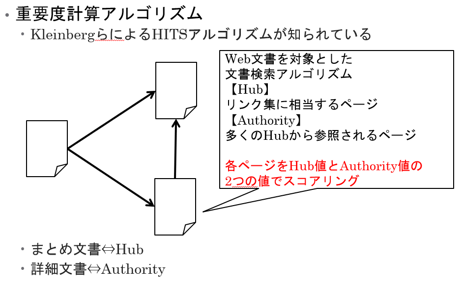
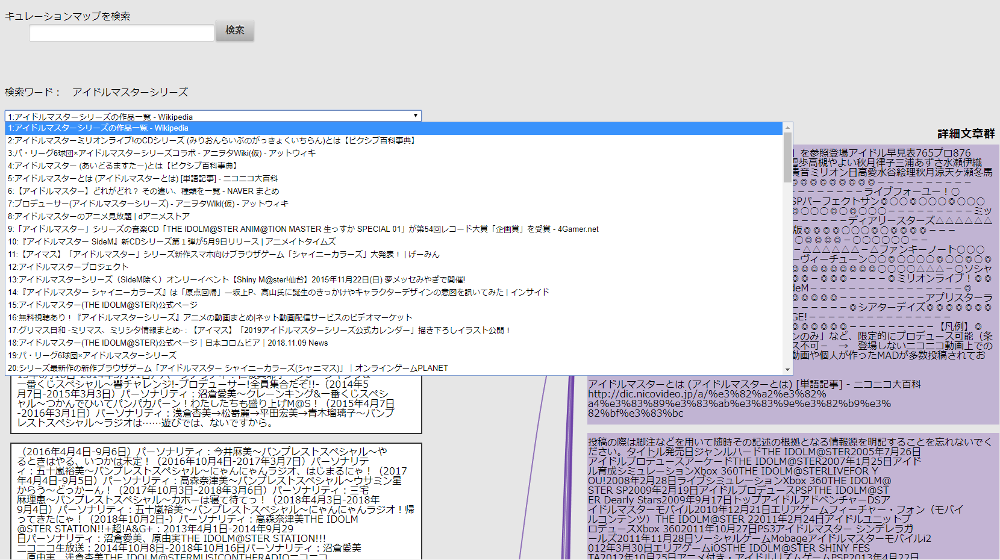

# キュレーションマップ自動生成システム

作成中。以下の内容は変更される可能性があります。

## モチベーション

Webをはじめ、大量の文書集合を利用して情報を得る場面は数多くあります。文書集合から必要な情報を得るために、現在は一般的にPageRankなどのランキングを表示する手法を用いて情報を取捨選択していますが、体系化されているわけではなく、ユーザが文書の選択を行う際に専門的な知識が必要であったり、目的の文書を得るまでに大量の文書を閲覧する必要があったりします。そこで、

- 文書同士の関係を解析し、その結果に基づいてネットワークを構成する
- 構成されたネットワークをわかりやすく提示する

の2つを行うことによって、文書集合を体系化し、目的の情報にたどり着くまでの人為的コストを削減することをねらいとしています。

## キュレーションとは

- キュレーション
  - インターネット上の情報を収集しまとめること。または収集した情報を分類し、つなぎ合わせて新しい価値を持たせて共有すること
- キュレーションサイト
  - Togetter
  - NAVERまとめ
- キュレーター（作成者）が存在する
  - 不要なものを排除し、わかりやすく作成できる
  - 一方で、偏った情報を意図的にまとめることも可能
  - 取りこぼしが発生するかも？

## キュレーションマップとは

- キュレーションマップ
  - 関連する文書の集合を、文書あるいは文書断片をノードとし、そのノードの関係を有向リンクで結んで表したネットワーク
  - マップ：「関連づける」の意
- まとめ文書を自動推定
  - HITSアルゴリズムを用いて、まとめ文書を自動推定
  - まとめ文書とその「リンク」及び「リンク先」に注目し、それを最初に提示するというアプローチで人間が読めるようにする
  - キュレーションマップそのものを表示しても、ノードとリンクの量が膨大で、どこから見ればよいかわからなくなってしまうため
- 自動生成
  - 人為的影響を軽減
  - キュレーターがいないトピックでも生成可能

## 自動生成手法・まとめ文書推定手法

1. 最小単位（現状では文単位）の表現でテキストを断片化
2. テキスト断片毎に他の文書との関連性を計算
3. リンク構造から同一観点と推定されるテキスト断片同士を併合

各テキスト断片が異なる文書とのリンクを持つ文書をまとめ文書とし、それを自動的に推定する。

まとめ文書推定アルゴリズム（HITSアルゴリズム）

## 構成

本システムは以下のリポジトリで構成されています。

- [CurationmapStarter](https://github.com/JotaroAbe/CurationmapStarter)
  - システムの起動に用いる
  - Dockerを使用
- [CurationmapViewer](https://github.com/JotaroAbe/CurationmapViewer)
  - キュレーションマップのビューワ
  - Webアプリケーション
- [CurationmapFactory](https://github.com/JotaroAbe/CurationmapFactory)
  - キュレーションマップのデータを収集
- [CurationmapDataStructure](https://github.com/JotaroAbe/CurationmapDataStructure)
  - キュレーションマップのデータ構造を定義

本システムを利用するためには、[CurationmapStarter](https://github.com/JotaroAbe/CurationmapStarter)を参照してください。

## スクリーンショット

↑左がまとめ文書、右が詳細文章群

↑まとめ文書らしさの指標に基づいて文書がランキングされている

↑テキスト断片をクリックするとリンク先を表示

↑詳細文章をクリックすると、その詳細文章が含まれる文書をまとめ文書として表示
